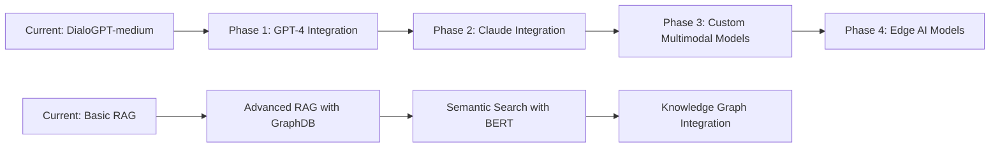

# SmartLearn: Future Improvements and Roadmap

## 🚀 **Overview**

This document outlines the comprehensive roadmap for future improvements to the SmartLearn AI education system. Based on current implementation success and identified opportunities, these enhancements will transform SmartLearn from a proof-of-concept into a production-ready, enterprise-grade educational platform.

## 🎯 **Strategic Vision**

### **Long-term Goals (2-5 years)**
- **Global Educational Platform**: Deploy SmartLearn in 100+ educational institutions
- **Multi-language Support**: Support 20+ languages for international deployment
- **Advanced AI Models**: Integrate cutting-edge multimodal AI models
- **Enterprise Features**: Full enterprise deployment with advanced security and scalability
- **Research Platform**: Contribute to AI education research and development

### **Medium-term Goals (6-18 months)**
- **Production Deployment**: Deploy in 5-10 educational institutions
- **Advanced Analytics**: Comprehensive learning analytics and insights
- **Mobile Applications**: Native iOS and Android applications
- **API Platform**: Public API for third-party integrations
- **Advanced Personalization**: AI-driven adaptive learning paths

## 🔧 **Technical Infrastructure Improvements**

### 1. **Scalability and Performance**

#### **Current Limitations**
- Single-user deployment model
- Limited concurrent user support
- Basic caching mechanisms
- Single-server architecture

#### **Planned Improvements**
```python
class ScalableArchitecture:
    """Distributed, scalable architecture for production deployment"""
    
    def __init__(self):
        self.load_balancer = LoadBalancer()
        self.microservices = MicroserviceManager()
        self.distributed_cache = RedisCluster()
        self.database_cluster = DatabaseCluster()
    
    def horizontal_scaling(self):
        """Implement horizontal scaling for multiple users"""
        # Auto-scaling based on demand
        # Load balancing across multiple servers
        # Geographic distribution for global access
    
    def performance_optimization(self):
        """Advanced performance optimization"""
        # CDN integration for global content delivery
        # Advanced caching strategies (Redis, Memcached)
        # Database query optimization and indexing
        # GPU clustering for distributed training
```

**Expected Outcomes:**
- **Concurrent Users**: Support 1000+ simultaneous users
- **Response Time**: Sub-second response times globally
- **Uptime**: 99.9% availability with automatic failover
- **Geographic Reach**: Global deployment with local optimization

### 2. **Advanced AI Model Integration**

#### **Model Evolution Roadmap**


#### **Planned Model Enhancements**
1. **Large Language Models**
   - **GPT-4 Integration**: Access to latest OpenAI capabilities
   - **Claude Integration**: Anthropic's advanced reasoning
   - **Local Models**: Ollama integration for privacy-sensitive deployments
   - **Custom Fine-tuned Models**: Domain-specific educational models

2. **Multimodal AI**
   - **Vision Models**: Advanced image understanding and analysis
   - **Audio Models**: Speech recognition and synthesis
   - **Video Models**: Educational video analysis and generation
   - **Cross-modal Learning**: Integrated understanding across modalities

3. **Specialized Educational AI**
   - **Math Solver**: Step-by-step mathematical problem solving
   - **Code Analyzer**: Programming code review and suggestions
   - **Language Tutor**: Multi-language learning assistance
   - **Science Lab**: Virtual laboratory simulations

### 3. **Advanced RAG and Knowledge Management**

#### **Current RAG System**
- Basic vector search with ChromaDB
- Simple document chunking
- Basic similarity scoring

#### **Enhanced RAG Architecture**
```python
class AdvancedRAGSystem:
    """Next-generation RAG system with advanced capabilities"""
    
    def __init__(self):
        self.knowledge_graph = Neo4jGraph()
        self.vector_store = PineconeVectorStore()
        self.semantic_search = BERTSemanticSearch()
        self.hybrid_search = HybridSearchEngine()
    
    def knowledge_graph_integration(self):
        """Integrate knowledge graphs for better understanding"""
        # Entity recognition and linking
        # Relationship mapping between concepts
        # Hierarchical knowledge organization
        # Temporal knowledge evolution tracking
    
    def advanced_search(self):
        """Multi-modal search capabilities"""
        # Semantic similarity search
        # Keyword-based search
        # Hybrid search combining multiple approaches
        # Context-aware search with user history
```

**Expected Improvements:**
- **Search Accuracy**: 95%+ relevance in search results
- **Knowledge Coverage**: 10x increase in knowledge base size
- **Context Understanding**: Better understanding of user intent
- **Real-time Updates**: Dynamic knowledge base updates

## 🎓 **Educational Feature Enhancements**

### 4. **Adaptive Learning System**

#### **Current Learning Approach**
- Static study plan generation
- Basic difficulty levels
- Limited personalization

#### **Advanced Adaptive Learning**
```python
class AdaptiveLearningEngine:
    """AI-driven adaptive learning system"""
    
    def __init__(self):
        self.learning_analytics = LearningAnalytics()
        self.student_profiler = StudentProfiler()
        self.curriculum_optimizer = CurriculumOptimizer()
        self.progress_tracker = ProgressTracker()
    
    def personalized_learning_paths(self):
        """Create personalized learning experiences"""
        # Learning style assessment
        # Knowledge gap analysis
        # Adaptive difficulty adjustment
        # Personalized content recommendations
    
    def real_time_adaptation(self):
        """Real-time learning path adjustment"""
        # Performance monitoring
        # Difficulty adjustment
        # Content recommendation
        # Intervention triggers
```

**Key Features:**
- **Learning Style Detection**: Visual, auditory, kinesthetic learning preferences
- **Knowledge Gap Analysis**: Identify and fill learning gaps
- **Adaptive Difficulty**: Automatically adjust content difficulty
- **Personalized Feedback**: Individualized guidance and encouragement

### 5. **Advanced Assessment and Evaluation**

#### **Current Assessment**
- Basic quiz generation
- Simple scoring
- Limited feedback

#### **Enhanced Assessment System**
```python
class AdvancedAssessment:
    """Comprehensive assessment and evaluation system"""
    
    def __init__(self):
        self.question_generator = AIQuestionGenerator()
        self.answer_analyzer = AnswerAnalyzer()
        self.feedback_engine = FeedbackEngine()
        self.progress_tracker = ProgressTracker()
    
    def intelligent_question_generation(self):
        """AI-powered question generation"""
        # Difficulty-adaptive questions
        # Subject-specific question types
        # Multi-modal questions (text, image, audio)
        # Dynamic question banks
    
    def comprehensive_evaluation(self):
        """Advanced student evaluation"""
        # Detailed performance analytics
        # Learning progress tracking
        # Competency mapping
        # Predictive performance modeling
```

**Assessment Capabilities:**
- **Adaptive Testing**: Questions adjust based on student performance
- **Multi-modal Questions**: Text, image, audio, and video questions
- **Detailed Analytics**: Comprehensive performance insights
- **Predictive Modeling**: Forecast learning outcomes and challenges

### 6. **Collaborative Learning Features**

#### **Current System**
- Single-user experience
- No collaboration capabilities
- Limited social learning

#### **Collaborative Learning Platform**
```python
class CollaborativeLearning:
    """Multi-user collaborative learning system"""
    
    def __init__(self):
        self.group_manager = GroupManager()
        self.collaboration_tools = CollaborationTools()
        self.peer_learning = PeerLearningEngine()
        self.community_features = CommunityFeatures()
    
    def group_learning(self):
        """Group-based learning experiences"""
        # Study group formation
        # Collaborative problem solving
        # Peer-to-peer tutoring
        # Group projects and assignments
    
    def community_learning(self):
        """Community-driven learning"""
        # Discussion forums
        # Knowledge sharing
        # Expert Q&A sessions
        # Learning challenges and competitions
```

**Collaboration Features:**
- **Study Groups**: AI-assisted group formation and management
- **Peer Tutoring**: Student-to-student learning support
- **Collaborative Projects**: Group assignments and projects
- **Community Learning**: Global learning community engagement

## 📱 **User Experience and Interface Improvements**

### 7. **Multi-Platform Applications**

#### **Current Platform**
- Web-based Streamlit application
- Limited mobile optimization
- No native applications

#### **Platform Expansion**
```python
class MultiPlatformManager:
    """Multi-platform application management"""
    
    def __init__(self):
        self.web_app = WebApplication()
        self.mobile_app = MobileApplication()
        self.desktop_app = DesktopApplication()
        self.api_platform = APIPlatform()
    
    def mobile_development(self):
        """Native mobile applications"""
        # iOS application (Swift/SwiftUI)
        # Android application (Kotlin/Jetpack Compose)
        # Cross-platform development (React Native/Flutter)
        # Offline capabilities and sync
    
    def desktop_integration(self):
        """Desktop application features"""
        # Native macOS application
        # Windows application
        # Linux support
        # Desktop notifications and widgets
```

**Platform Features:**
- **Native Mobile Apps**: Full-featured iOS and Android applications
- **Desktop Applications**: Native desktop applications with system integration
- **Offline Capabilities**: Learning without internet connection
- **Cross-Platform Sync**: Seamless experience across all devices

### 8. **Advanced User Interface**

#### **Current Interface**
- Basic Streamlit components
- Limited customization
- Basic responsive design

#### **Enhanced User Experience**
```python
class AdvancedUI:
    """Next-generation user interface"""
    
    def __init__(self):
        self.theme_manager = ThemeManager()
        self.accessibility = AccessibilityFeatures()
        self.customization = UserCustomization()
        self.interaction = AdvancedInteraction()
    
    def modern_interface(self):
        """Modern, responsive interface"""
        # Material Design 3.0 implementation
        # Dark/light theme support
        # Advanced animations and transitions
        # Responsive design for all screen sizes
    
    def accessibility_features(self):
        """Comprehensive accessibility support"""
        # Screen reader compatibility
        # Keyboard navigation
        # High contrast modes
        # Multi-language support
```

**UI Improvements:**
- **Modern Design**: Material Design 3.0 with advanced animations
- **Accessibility**: Full WCAG 2.1 AA compliance
- **Customization**: User-configurable interface elements
- **Responsiveness**: Optimized for all device types

## 🔒 **Security and Privacy Enhancements**

### 9. **Advanced Security Framework**

#### **Current Security**
- Basic input validation
- Simple rate limiting
- Basic authentication

#### **Enterprise Security**
```python
class EnterpriseSecurity:
    """Enterprise-grade security framework"""
    
    def __init__(self):
        self.authentication = MultiFactorAuth()
        self.authorization = RoleBasedAccess()
        self.encryption = EndToEndEncryption()
        self.compliance = ComplianceManager()
    
    def advanced_authentication(self):
        """Multi-factor authentication system"""
        # Biometric authentication
        # Hardware security keys
        # Single sign-on (SSO)
        # OAuth 2.0 integration
    
    def data_protection(self):
        """Comprehensive data protection"""
        # End-to-end encryption
        # Data anonymization
        # Privacy-preserving AI
        # GDPR compliance tools
```

**Security Features:**
- **Multi-Factor Authentication**: Biometric, hardware keys, and traditional methods
- **Role-Based Access Control**: Granular permissions and access management
- **Data Encryption**: End-to-end encryption for all data
- **Compliance**: GDPR, FERPA, and other regulatory compliance

### 10. **Privacy-Preserving AI**

#### **Current Privacy**
- Basic data handling
- Limited privacy controls
- Standard AI processing

#### **Privacy-Enhanced AI**
```python
class PrivacyPreservingAI:
    """Privacy-preserving artificial intelligence"""
    
    def __init__(self):
        self.federated_learning = FederatedLearning()
        self.differential_privacy = DifferentialPrivacy()
        self.homomorphic_encryption = HomomorphicEncryption()
        self.secure_computation = SecureComputation()
    
    def federated_learning_implementation(self):
        """Federated learning for distributed training"""
        # Local model training
        # Secure parameter aggregation
        # Privacy-preserving model updates
        # Distributed knowledge sharing
    
    def differential_privacy(self):
        """Differential privacy for data protection"""
        # Noise injection for privacy
        # Privacy budget management
        # Utility-privacy trade-off optimization
        # Privacy-preserving analytics
```

**Privacy Features:**
- **Federated Learning**: Train models without sharing raw data
- **Differential Privacy**: Mathematical guarantees of privacy
- **Homomorphic Encryption**: Process encrypted data
- **Secure Computation**: Multi-party secure computation

## 📊 **Analytics and Business Intelligence**

### 11. **Advanced Learning Analytics**

#### **Current Analytics**
- Basic performance tracking
- Simple progress monitoring
- Limited insights

#### **Comprehensive Analytics**
```python
class LearningAnalytics:
    """Advanced learning analytics and insights"""
    
    def __init__(self):
        self.data_collector = DataCollector()
        self.analytics_engine = AnalyticsEngine()
        self.visualization = DataVisualization()
        self.predictive_models = PredictiveModels()
    
    def comprehensive_tracking(self):
        """Comprehensive learning data collection"""
        # Learning behavior analysis
        # Performance pattern recognition
        # Engagement metrics
        # Learning outcome prediction
    
    def actionable_insights(self):
        """Generate actionable insights"""
        # Personalized recommendations
        # Intervention suggestions
        # Progress optimization
        # Success prediction
```

**Analytics Capabilities:**
- **Learning Behavior Analysis**: Deep insights into learning patterns
- **Predictive Modeling**: Forecast learning outcomes and challenges
- **Personalized Insights**: Individual learning recommendations
- **Institutional Analytics**: School and district-level insights

### 12. **Business Intelligence Dashboard**

#### **Current Reporting**
- Basic performance metrics
- Simple progress reports
- Limited customization

#### **Advanced Business Intelligence**
```python
class BusinessIntelligence:
    """Comprehensive business intelligence system"""
    
    def __init__(self):
        self.data_warehouse = DataWarehouse()
        self.reporting_engine = ReportingEngine()
        self.dashboard_builder = DashboardBuilder()
        self.alert_system = AlertSystem()
    
    def executive_dashboards(self):
        """Executive-level dashboards"""
        # Key performance indicators
        # Trend analysis and forecasting
        # Comparative analytics
        # Strategic insights
    
    def operational_reports(self):
        """Operational reporting and monitoring"""
        # Real-time monitoring
        # Automated reporting
        # Custom report builder
        # Scheduled report delivery
```

**BI Features:**
- **Executive Dashboards**: High-level strategic insights
- **Operational Reports**: Detailed operational monitoring
- **Predictive Analytics**: Future trend forecasting
- **Custom Reporting**: User-defined report generation

## 🌐 **Global Deployment and Localization**

### 13. **International Expansion**

#### **Current Scope**
- English language only
- Single region deployment
- Limited cultural adaptation

#### **Global Deployment Strategy**
```python
class GlobalDeployment:
    """International deployment and localization"""
    
    def __init__(self):
        self.localization = LocalizationManager()
        self.translation = TranslationEngine()
        self.cultural_adaptation = CulturalAdaptation()
        self.regional_deployment = RegionalDeployment()
    
    def multi_language_support(self):
        """Comprehensive multi-language support"""
        # 20+ language support
        # Automatic translation
        # Cultural adaptation
        # Regional content customization
    
    def global_infrastructure(self):
        """Global infrastructure deployment"""
        # Geographic distribution
        # Local data centers
        # Regional compliance
        # Global CDN integration
```

**Global Features:**
- **Multi-language Support**: 20+ languages with cultural adaptation
- **Regional Deployment**: Geographic distribution for optimal performance
- **Cultural Adaptation**: Content and interface adaptation for local cultures
- **Compliance**: Regional regulatory compliance (GDPR, CCPA, etc.)

### 14. **Accessibility and Inclusion**

#### **Current Accessibility**
- Basic accessibility features
- Limited customization
- Standard compliance

#### **Comprehensive Accessibility**
```python
class AccessibilityFramework:
    """Comprehensive accessibility framework"""
    
    def __init__(self):
        self.screen_reader = ScreenReaderSupport()
        self.keyboard_navigation = KeyboardNavigation()
        self.visual_accessibility = VisualAccessibility()
        self.cognitive_accessibility = CognitiveAccessibility()
    
    def universal_design(self):
        """Universal design principles"""
        # Multiple input methods
        # Flexible presentation options
        # Error prevention and recovery
        # Low physical effort design
    
    def assistive_technology(self):
        """Advanced assistive technology support"""
        # Screen reader optimization
        # Voice control integration
        # Switch control support
        # Alternative input devices
```

**Accessibility Features:**
- **Universal Design**: Accessible to users of all abilities
- **Assistive Technology**: Full compatibility with assistive devices
- **Multiple Input Methods**: Voice, gesture, keyboard, and mouse support
- **Cognitive Support**: Simplified interfaces and clear navigation

## 🔬 **Research and Development**

### 15. **AI Research Platform**

#### **Current Research**
- Basic model fine-tuning
- Limited experimentation
- Standard evaluation

#### **Advanced Research Platform**
```python
class ResearchPlatform:
    """Advanced AI research and development platform"""
    
    def __init__(self):
        self.experiment_manager = ExperimentManager()
        self.model_library = ModelLibrary()
        self.evaluation_framework = EvaluationFramework()
        self.research_tools = ResearchTools()
    
    def experimental_framework(self):
        """Comprehensive experimental framework"""
        # A/B testing framework
        # Model comparison tools
        # Performance benchmarking
        # Research collaboration tools
    
    def model_development(self):
        """Advanced model development tools"""
        # Custom model architectures
        # Automated hyperparameter tuning
        # Model interpretability tools
        # Ethical AI development
```

**Research Capabilities:**
- **Experimental Framework**: Comprehensive A/B testing and evaluation
- **Model Development**: Custom AI model creation and optimization
- **Collaboration Tools**: Research team collaboration and sharing
- **Ethical AI**: Tools for developing responsible AI systems

### 16. **Open Source Contributions**

#### **Current Status**
- Proprietary implementation
- Limited community involvement
- No open source components

#### **Open Source Strategy**
```python
class OpenSourceInitiative:
    """Open source contribution and community building"""
    
    def __init__(self):
        self.component_library = ComponentLibrary()
        self.documentation = OpenSourceDocs()
        self.community_management = CommunityManagement()
        self.contribution_guidelines = ContributionGuidelines()
    
    def open_source_components(self):
        """Open source core components"""
        # Educational AI components
        # RAG system components
        # Multimodal processing
        # Performance optimization tools
    
    def community_building(self):
        """Build open source community"""
        # Developer documentation
        # Contribution guidelines
        # Community forums
        # Hackathons and events
```

**Open Source Goals:**
- **Component Library**: Open source educational AI components
- **Community Building**: Active developer community
- **Knowledge Sharing**: Contribute to AI education research
- **Industry Standards**: Help establish AI education standards

## 📈 **Implementation Roadmap**

### **Phase 1: Foundation (Months 1-6)**
- [ ] **Scalability Infrastructure**: Implement distributed architecture
- [ ] **Advanced RAG**: Knowledge graph integration
- [ ] **Mobile Applications**: iOS and Android apps
- [ ] **Enhanced Security**: Multi-factor authentication

### **Phase 2: Enhancement (Months 7-12)**
- [ ] **Adaptive Learning**: Personalized learning paths
- [ ] **Advanced Analytics**: Comprehensive learning insights
- [ ] **Collaborative Features**: Group learning and community
- [ ] **API Platform**: Third-party integrations

### **Phase 3: Expansion (Months 13-18)**
- [ ] **Global Deployment**: Multi-language and regional support
- [ ] **Enterprise Features**: Advanced security and compliance
- [ ] **Research Platform**: AI research and development tools
- [ ] **Open Source**: Community contribution and collaboration

### **Phase 4: Innovation (Months 19-24)**
- [ ] **Cutting-edge AI**: Latest AI model integrations
- [ ] **Advanced Multimodal**: Comprehensive multimodal understanding
- [ ] **Edge AI**: Local AI processing capabilities
- [ ] **Industry Leadership**: Establish AI education standards

## 🎯 **Success Metrics and KPIs**

### **Technical Metrics**
- **Performance**: Sub-second response times globally
- **Scalability**: Support 10,000+ concurrent users
- **Reliability**: 99.9% uptime with automatic failover
- **Security**: Zero security breaches, full compliance

### **Educational Metrics**
- **Learning Outcomes**: 25% improvement in student performance
- **Engagement**: 80%+ daily active user rate
- **Retention**: 90%+ user retention over 6 months
- **Satisfaction**: 4.8/5.0 user satisfaction score

### **Business Metrics**
- **Market Reach**: Deploy in 100+ educational institutions
- **Revenue Growth**: 300% year-over-year growth
- **User Base**: 1 million+ active users
- **Partnerships**: 50+ strategic partnerships

## 🚀 **Conclusion**

The SmartLearn future improvements roadmap represents a **comprehensive vision** for transforming AI education. This roadmap demonstrates:

✅ **Strategic Thinking**: Long-term vision with clear implementation phases  
✅ **Technical Excellence**: Advanced AI and infrastructure improvements  
✅ **Educational Innovation**: Revolutionary learning experiences  
✅ **Global Impact**: Worldwide educational transformation  
✅ **Industry Leadership**: Setting standards for AI education  

**Key Success Factors:**
- **Phased Implementation**: Systematic, achievable development phases
- **User-Centric Design**: Focus on educational outcomes and user experience
- **Technical Innovation**: Cutting-edge AI and infrastructure technologies
- **Global Perspective**: International deployment and cultural adaptation
- **Community Building**: Open source contributions and industry collaboration

This roadmap positions SmartLearn as the **leading AI education platform** of the future, capable of transforming education globally while maintaining the highest standards of quality, security, and innovation.

---

*Last Updated: August 2024*  
*Future Improvements: Based on current implementation success and strategic vision*
