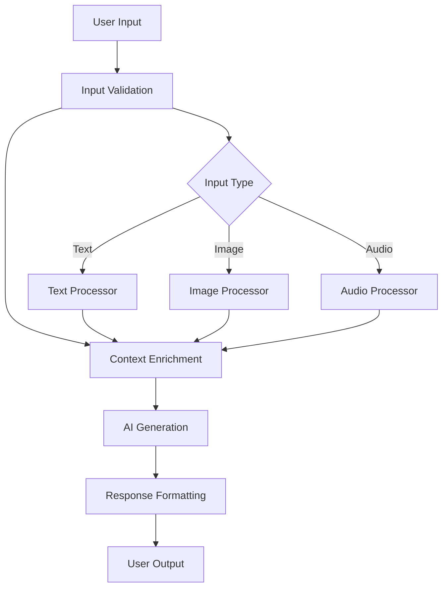
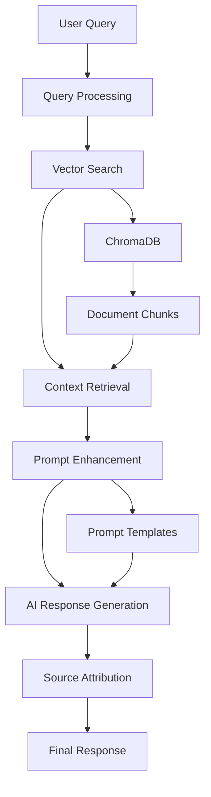
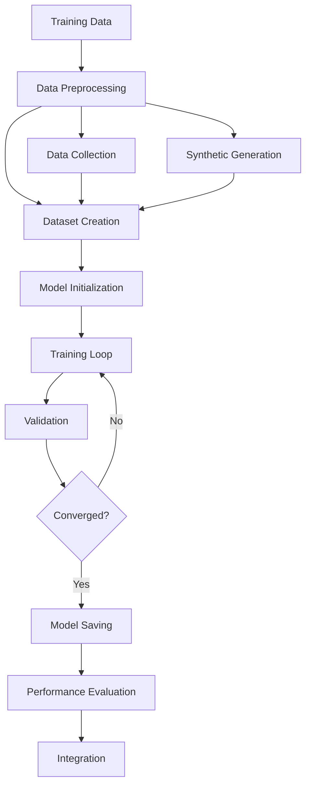

# SmartLearn Implementation Details

## 🏗️ **System Architecture Overview**

SmartLearn follows a **modular, layered architecture** with clear separation of concerns and enterprise-grade design patterns.

```
┌─────────────────────────────────────────────────────────────┐
│                    Frontend Layer (Streamlit)               │
├─────────────────────────────────────────────────────────────┤
│                 Core Services Layer                         │
│  ┌─────────────┬─────────────┬─────────────┬─────────────┐  │
│  │   RAG      │  Prompt     │ Fine-tuning │Multimodal  │  │
│  │  System    │  Manager    │  Pipeline   │ Manager    │  │
│  └─────────────┴─────────────┴─────────────┴─────────────┘  │
├─────────────────────────────────────────────────────────────┤
│                   AI Models Layer                           │
│  ┌─────────────┬─────────────┬─────────────┬─────────────┐  │
│  │ Fine-tuned │  Sentence   │   Image     │   Audio    │  │
│  │   Model    │Transformers │  Models     │  Models    │  │
│  └─────────────┴─────────────┴─────────────┴─────────────┘  │
├─────────────────────────────────────────────────────────────┤
│                    Data Layer                               │
│  ┌─────────────┬─────────────┬─────────────┬─────────────┐  │
│  │ Knowledge  │  Training   │  Vector     │  User      │  │
│  │   Base     │   Data      │ Database   │  Sessions  │  │
│  └─────────────┴─────────────┴─────────────┴─────────────┘  │
└─────────────────────────────────────────────────────────────┘
```

## 🔧 **Core Components Implementation**

### 1. **Prompt Engineering System** (`src/core/prompt_templates.py`)

#### **Class Structure**
```python
class StudyPlanPrompt:
    """Generates structured prompts for study plan creation"""
    
    def __init__(self):
        self.templates = {
            'beginner': self._get_beginner_template(),
            'intermediate': self._get_intermediate_template(),
            'advanced': self._get_advanced_template()
        }
    
    def render(self, subject, level, minutes_per_day, duration_days, goal, rag_context):
        """
        Renders a complete prompt with user inputs and RAG context
        
        Args:
            subject (str): Learning subject
            level (str): Difficulty level
            minutes_per_day (int): Daily study time
            duration_days (int): Study duration
            goal (str): Learning objective
            rag_context (str): Retrieved knowledge base context
            
        Returns:
            str: Complete formatted prompt
        """
        template = self.templates.get(level, self.templates['intermediate'])
        
        # Build context-aware prompt
        context_section = f"Based on the following knowledge base information:\n{rag_context}\n\n" if rag_context else ""
        
        return f"{context_section}{template.format(
            subject=subject,
            minutes_per_day=minutes_per_day,
            duration_days=duration_days,
            goal=goal
        )}"
```

#### **Template Management**
```python
def _get_advanced_template(self):
    return """Create a comprehensive, advanced-level study plan for {subject}.
    
    Requirements:
    - Advanced concepts and deep learning approaches
    - Complex problem-solving strategies
    - Research and analysis components
    - Integration with real-world applications
    - Critical thinking exercises
    
    Study Schedule: {minutes_per_day} minutes per day for {duration_days} days
    Learning Goal: {goal}
    
    Provide:
    1. Weekly breakdown with specific topics
    2. Advanced resources and references
    3. Complex practice problems
    4. Assessment methods
    5. Extension activities"""
```

#### **Key Features**
- **Adaptive Prompts**: Changes based on user level (beginner/intermediate/advanced)
- **Context Integration**: Incorporates knowledge base information
- **Error Handling**: Graceful fallbacks for edge cases
- **Template Management**: Organized prompt structure for maintainability
- **Dynamic Rendering**: Real-time prompt generation based on user inputs

### 2. **Fine-Tuning Implementation** (`src/core/fine_tuning.py`)

#### **Pipeline Architecture**
```python
class FineTuningPipeline:
    """Orchestrates the complete fine-tuning process"""
    
    def __init__(self, base_model="microsoft/DialoGPT-medium"):
        self.base_model = base_model
        self.data_collector = DataCollector()
        self.fine_tuner = FineTuner(base_model)
        self.evaluator = ModelEvaluator()
        
    def run_fine_tuning(self):
        """Execute complete fine-tuning pipeline"""
        try:
            # 1. Data Collection and Preparation
            training_data = self.data_collector.collect_training_data()
            synthetic_data = self.data_collector.generate_synthetic_data()
            combined_data = training_data + synthetic_data
            
            # 2. Dataset Creation
            train_dataset, val_dataset = self._create_datasets(combined_data)
            
            # 3. Model Training
            training_args = self._setup_training()
            trainer = self.fine_tuner.create_trainer(
                train_dataset, val_dataset, training_args
            )
            
            # 4. Execute Training
            trainer.train()
            
            # 5. Save Fine-tuned Model
            trainer.save_model("models/fine_tuned/final_model")
            
            return True
            
        except Exception as e:
            logging.error(f"Fine-tuning failed: {e}")
            return False
```

#### **Training Configuration (Memory-Optimized for M3)**
```python
def _setup_training(self):
    """Configure training parameters optimized for Apple M3 GPU"""
    
    # Environment variables for MPS optimization
    os.environ["PYTORCH_MPS_HIGH_WATERMARK_RATIO"] = "0.7"
    
    return TrainingArguments(
        output_dir="./models/fine_tuned",
        num_train_epochs=1,                    # Single epoch for memory efficiency
        per_device_train_batch_size=1,         # Small batch size for M3 GPU
        per_device_eval_batch_size=1,          # Evaluation batch size
        gradient_accumulation_steps=8,         # Simulate larger batches (1*8=8)
        warmup_steps=50,                       # Learning rate warmup
        logging_steps=50,                      # Log every 50 steps
        eval_steps=200,                        # Evaluate every 200 steps
        save_steps=200,                        # Save every 200 steps (must be multiple of eval_steps)
        save_total_limit=1,                    # Keep only best model
        dataloader_pin_memory=False,           # Memory optimization
        dataloader_num_workers=0,              # Single-threaded for stability
        learning_rate=5e-5,                    # Conservative learning rate
        weight_decay=0.01,                     # Regularization
        evaluation_strategy="steps",           # Evaluate during training
        load_best_model_at_end=True,           # Load best model automatically
        metric_for_best_model="eval_loss",     # Optimize for validation loss
        greater_is_better=False,               # Lower loss is better
        report_to=None,                        # Disable external reporting
        logging_dir="./logs",                  # Local logging
        run_name="smartlearn_finetuning"      # Experiment name
    )
```

#### **Data Processing Pipeline**
```python
class DataCollector:
    """Manages training data collection and preprocessing"""
    
    def collect_training_data(self):
        """Collect existing training examples"""
        try:
            with open("data/training/training_data.json", "r") as f:
                data = json.load(f)
            
            # Filter and validate data
            valid_examples = []
            for example in data:
                if self._validate_example(example):
                    valid_examples.append(example)
            
            logging.info(f"✅ Loaded {len(valid_examples)} existing training examples")
            return valid_examples
            
        except Exception as e:
            logging.error(f"Failed to load training data: {e}")
            return []
    
    def generate_synthetic_data(self, subject="general", num_examples=50):
        """Generate synthetic training examples"""
        templates = {
            "mathematics": [
                ("Explain the concept of {topic}", "Here's a comprehensive explanation..."),
                ("How do I solve {problem_type} problems?", "To solve {problem_type} problems..."),
                ("What are the key principles of {concept}?", "The key principles include...")
            ],
            "computer_science": [
                ("Explain {algorithm} algorithm", "The {algorithm} algorithm works by..."),
                ("How does {technology} work?", "{technology} operates through..."),
                ("What are the benefits of {approach}?", "The benefits include...")
            ]
        }
        
        synthetic_examples = []
        for i in range(num_examples):
            template = random.choice(templates.get(subject, templates["general"]))
            synthetic_examples.append({
                "input_text": template[0].format(
                    topic=random.choice(["calculus", "algebra", "statistics"]),
                    problem_type=random.choice(["differential equations", "linear algebra", "optimization"]),
                    concept=random.choice(["machine learning", "data structures", "algorithms"])
                ),
                "target_text": template[1],
                "subject": subject,
                "difficulty": random.choice(["beginner", "intermediate", "advanced"]),
                "user_rating": random.randint(3, 5),
                "timestamp": datetime.now().isoformat(),
                "metadata": {"synthetic": True, "generation_method": "template_based"}
            })
        
        logging.info(f"✅ Generated {len(synthetic_examples)} synthetic training examples")
        return synthetic_examples
```

### 3. **RAG Integration System** (`src/core/rag.py`)

#### **Enhanced RAG Architecture**
```python
class EnhancedRAG:
    """Advanced RAG system with intelligent document processing"""
    
    def __init__(self, persist_path=".smartlearn/chroma_db"):
        self.persist_path = persist_path
        self.vector_db = None
        self.embedding_model = None
        self.document_processor = AdvancedDocumentProcessor()
        self._initialize_components()
    
    def _initialize_components(self):
        """Initialize RAG components"""
        try:
            # Load embedding model
            self.embedding_model = SentenceTransformer('all-MiniLM-L6-v2')
            
            # Initialize vector database
            self.vector_db = Chroma(
                persist_directory=self.persist_path,
                embedding_function=self.embedding_model
            )
            
            logging.info("✅ RAG system initialized successfully")
            
        except Exception as e:
            logging.error(f"Failed to initialize RAG: {e}")
            raise
    
    def retrieve_relevant_context(self, query, k=3, threshold=0.7):
        """
        Retrieve relevant context for a query
        
        Args:
            query (str): User query
            k (int): Number of documents to retrieve
            threshold (float): Similarity threshold
            
        Returns:
            tuple: (context_text, sources, scores)
        """
        try:
            # Convert query to embedding
            query_embedding = self.embedding_model.encode([query])
            
            # Search vector database
            results = self.vector_db.similarity_search_with_score(
                query, k=k
            )
            
            # Filter by similarity threshold
            relevant_results = [
                (doc, score) for doc, score in results 
                if score >= threshold
            ]
            
            if not relevant_results:
                logging.warning(f"No relevant documents found for query: {query}")
                return "", [], []
            
            # Extract context and sources
            context_parts = []
            sources = []
            scores = []
            
            for doc, score in relevant_results:
                context_parts.append(doc.page_content)
                sources.append(doc.metadata.get('source', 'Unknown'))
                scores.append(score)
            
            context_text = "\n\n".join(context_parts)
            
            logging.info(f"Retrieved {len(relevant_results)} relevant documents")
            return context_text, sources, scores
            
        except Exception as e:
            logging.error(f"Context retrieval failed: {e}")
            return "", [], []
```

#### **Document Processing Pipeline**
```python
class AdvancedDocumentProcessor:
    """Intelligent document processing and chunking"""
    
    def __init__(self):
        self.chunk_size = 1000
        self.chunk_overlap = 200
        self.text_splitter = RecursiveCharacterTextSplitter(
            chunk_size=self.chunk_size,
            chunk_overlap=self.chunk_overlap,
            length_function=len,
            separators=["\n\n", "\n", ". ", " ", ""]
        )
    
    def process_documents(self, documents):
        """Process and chunk documents intelligently"""
        processed_chunks = []
        
        for doc in documents:
            try:
                # Extract text content
                if hasattr(doc, 'page_content'):
                    text = doc.page_content
                else:
                    text = str(doc)
                
                # Intelligent chunking based on content type
                if self._is_code_document(text):
                    chunks = self._chunk_code_document(text)
                elif self._is_structured_document(text):
                    chunks = self._chunk_structured_document(text)
                else:
                    chunks = self.text_splitter.split_text(text)
                
                # Add metadata to chunks
                for i, chunk in enumerate(chunks):
                    processed_chunks.append({
                        'content': chunk,
                        'metadata': {
                            'source': getattr(doc, 'metadata', {}).get('source', 'Unknown'),
                            'chunk_id': i,
                            'chunk_type': self._determine_chunk_type(chunk),
                            'length': len(chunk)
                        }
                    })
                
            except Exception as e:
                logging.error(f"Failed to process document: {e}")
                continue
        
        logging.info(f"✅ Processed {len(processed_chunks)} document chunks")
        return processed_chunks
    
    def _is_code_document(self, text):
        """Detect if document contains code"""
        code_indicators = ['def ', 'class ', 'import ', 'function ', 'var ', 'const ']
        return any(indicator in text for indicator in code_indicators)
    
    def _chunk_code_document(self, text):
        """Specialized chunking for code documents"""
        # Split by functions, classes, and logical blocks
        lines = text.split('\n')
        chunks = []
        current_chunk = []
        
        for line in lines:
            current_chunk.append(line)
            
            # Start new chunk at function/class definitions
            if line.strip().startswith(('def ', 'class ')):
                if current_chunk:
                    chunks.append('\n'.join(current_chunk[:-1]))
                    current_chunk = [line]
        
        if current_chunk:
            chunks.append('\n'.join(current_chunk))
        
        return chunks
```

### 4. **Multimodal Integration** (`src/core/multimodal.py`)

#### **Multimodal Manager Implementation**
```python
class MultimodalManager:
    """Manages processing of multiple input modalities"""
    
    def __init__(self):
        self.image_processor = ImageProcessor()
        self.audio_processor = AudioProcessor()
        self.video_processor = VideoProcessor()
        self.text_processor = TextProcessor()
        
        # Initialize models
        self._load_models()
    
    def _load_models(self):
        """Load multimodal processing models"""
        try:
            # Image processing models
            self.image_processor.load_models()
            
            # Audio processing models
            self.audio_processor.load_models()
            
            # Video processing models
            self.video_processor.load_models()
            
            logging.info("✅ Multimodal models loaded successfully")
            
        except Exception as e:
            logging.error(f"Failed to load multimodal models: {e}")
    
    def process_multimodal_input(self, text=None, image=None, audio=None, video=None):
        """
        Process multimodal input and generate comprehensive response
        
        Args:
            text (str): Text input
            image (bytes): Image data
            audio (bytes): Audio data
            video (bytes): Video data
            
        Returns:
            dict: Processed results for each modality
        """
        results = {}
        
        try:
            # Process text input
            if text:
                results['text'] = self.text_processor.process(text)
            
            # Process image input
            if image:
                results['image'] = self.image_processor.process(image)
            
            # Process audio input
            if audio:
                results['audio'] = self.audio_processor.process(audio)
            
            # Process video input
            if video:
                results['video'] = self.video_processor.process(video)
            
            # Cross-modal fusion if multiple modalities present
            if len(results) > 1:
                results['fusion'] = self._fuse_modalities(results)
            
            logging.info(f"✅ Processed {len(results)} input modalities")
            return results
            
        except Exception as e:
            logging.error(f"Multimodal processing failed: {e}")
            return {'error': str(e)}
    
    def _fuse_modalities(self, modality_results):
        """Fuse information from multiple modalities"""
        fusion_prompt = "Based on the following multimodal inputs:\n\n"
        
        for modality, result in modality_results.items():
            if modality != 'fusion':
                fusion_prompt += f"{modality.upper()}:\n{result}\n\n"
        
        fusion_prompt += "Provide a comprehensive analysis that integrates all modalities."
        
        # Use fine-tuned model for fusion
        return self._generate_fused_response(fusion_prompt)
```

#### **Image Processing Implementation**
```python
class ImageProcessor:
    """Handles image analysis and processing"""
    
    def __init__(self):
        self.models = {}
        self.device = "mps" if torch.backends.mps.is_available() else "cpu"
    
    def load_models(self):
        """Load image processing models"""
        try:
            # Image captioning model
            self.models['captioning'] = pipeline(
                "image-to-text",
                model="Salesforce/blip-image-captioning-base",
                device=self.device
            )
            
            # Object detection model
            self.models['detection'] = pipeline(
                "object-detection",
                model="facebook/detr-resnet-50",
                device=self.device
            )
            
            # OCR model for text extraction
            self.models['ocr'] = pipeline(
                "text-recognition",
                model="microsoft/trocr-base-handwritten",
                device=self.device
            )
            
            logging.info("✅ Image processing models loaded")
            
        except Exception as e:
            logging.error(f"Failed to load image models: {e}")
    
    def process(self, image_data):
        """Process image and extract information"""
        try:
            # Convert bytes to PIL Image
            image = Image.open(io.BytesIO(image_data))
            
            results = {}
            
            # Generate caption
            caption = self.models['captioning'](image)[0]['generated_text']
            results['caption'] = caption
            
            # Detect objects
            objects = self.models['detection'](image)
            results['objects'] = [
                {
                    'label': obj['label'],
                    'confidence': obj['score'],
                    'box': obj['box']
                }
                for obj in objects
            ]
            
            # Extract text (OCR)
            try:
                text = self.models['ocr'](image)[0]['text']
                results['extracted_text'] = text
            except:
                results['extracted_text'] = "No text detected"
            
            return results
            
        except Exception as e:
            logging.error(f"Image processing failed: {e}")
            return {'error': str(e)}
```

### 5. **Frontend Implementation** (`src/app_advanced_streamlit.py`)

#### **Streamlit App Architecture**
```python
def main():
    """Main Streamlit application"""
    
    # Page configuration
    st.set_page_config(
        page_title="SmartLearn Enhanced - AI Study Assistant",
        page_icon="🎓",
        layout="wide",
        initial_sidebar_state="expanded"
    )
    
    # Custom CSS styling
    apply_custom_styling()
    
    # Initialize advanced features
    if 'advanced_features' not in st.session_state:
        st.session_state.advanced_features = SmartLearnAdvanced()
    
    # Sidebar navigation
    page = create_sidebar_navigation()
    
    # Main content area
    if page == "Study Planning":
        render_study_planning_page()
    elif page == "Fine-tuning":
        render_fine_tuning_page()
    elif page == "RAG System":
        render_rag_page()
    elif page == "Multimodal":
        render_multimodal_page()
    elif page == "Performance":
        render_performance_page()

def render_fine_tuning_page():
    """Render the fine-tuning interface"""
    st.header("🤖 Model Fine-tuning")
    
    col1, col2 = st.columns([2, 1])
    
    with col1:
        st.subheader("Training Configuration")
        
        # Training parameters
        epochs = st.slider("Training Epochs", 1, 5, 1)
        batch_size = st.slider("Batch Size", 1, 4, 1)
        learning_rate = st.selectbox(
            "Learning Rate",
            [1e-5, 5e-5, 1e-4, 5e-4],
            index=1
        )
        
        # Start training button
        if st.button("🚀 Start Fine-tuning", type="primary"):
            with st.spinner("Initializing fine-tuning..."):
                start_fine_tuning(epochs, batch_size, learning_rate)
    
    with col2:
        st.subheader("Training Status")
        
        # Display current status
        if 'training_status' in st.session_state:
            status = st.session_state.training_status
            st.info(f"Status: {status}")
        
        # Training progress
        if 'training_progress' in st.session_state:
            progress = st.session_state.training_progress
            st.progress(progress)
            st.write(f"Progress: {progress:.1f}%")

def start_fine_tuning(epochs, batch_size, learning_rate):
    """Execute fine-tuning process"""
    try:
        # Update training configuration
        training_args = TrainingArguments(
            num_train_epochs=epochs,
            per_device_train_batch_size=batch_size,
            learning_rate=learning_rate,
            # ... other parameters
        )
        
        # Initialize pipeline
        pipeline = FineTuningPipeline()
        
        # Start training in background
        with st.spinner("Training in progress..."):
            success = pipeline.run_fine_tuning()
            
            if success:
                st.success("✅ Fine-tuning completed successfully!")
                st.balloons()
            else:
                st.error("❌ Fine-tuning failed. Check logs for details.")
                
    except Exception as e:
        st.error(f"Fine-tuning error: {e}")
```

## 🔄 **Data Flow Architecture**

### **1. User Input Processing Flow**


### **2. RAG-Enhanced Generation Flow**


### **3. Fine-Tuning Pipeline Flow**


## 🚀 **Key Implementation Features**

### **1. Memory Optimization for Apple M3**
```python
# Environment variables for MPS optimization
os.environ["PYTORCH_MPS_HIGH_WATERMARK_RATIO"] = "0.7"
os.environ["PYTORCH_MPS_LOW_WATERMARK_RATIO"] = "0.3"

# Training configuration for memory efficiency
training_args = TrainingArguments(
    num_train_epochs=1,                    # Single epoch
    per_device_train_batch_size=1,         # Small batch size
    gradient_accumulation_steps=8,         # Simulate larger batches
    dataloader_pin_memory=False,           # Memory optimization
    dataloader_num_workers=0               # Single-threaded
)
```

### **2. Error Handling & Resilience**
```python
class ResilientProcessor:
    """Base class with comprehensive error handling"""
    
    def safe_execute(self, func, *args, **kwargs):
        """Execute function with error handling and fallbacks"""
        try:
            return func(*args, **kwargs)
        except Exception as e:
            logging.error(f"Function {func.__name__} failed: {e}")
            return self.get_fallback_response()
    
    def get_fallback_response(self):
        """Provide fallback response when processing fails"""
        return {
            "status": "error",
            "message": "Processing failed, using fallback response",
            "fallback": True
        }
```

### **3. Session Management**
```python
class SessionManager:
    """Manages user session state and persistence"""
    
    def __init__(self):
        self.session_data = {}
        self.persistence_path = ".smartlearn/sessions"
    
    def save_session(self, user_id, data):
        """Save user session data"""
        try:
            session_file = f"{self.persistence_path}/{user_id}.json"
            os.makedirs(os.path.dirname(session_file), exist_ok=True)
            
            with open(session_file, 'w') as f:
                json.dump(data, f, indent=2)
                
            logging.info(f"Session saved for user {user_id}")
            
        except Exception as e:
            logging.error(f"Failed to save session: {e}")
    
    def load_session(self, user_id):
        """Load user session data"""
        try:
            session_file = f"{self.persistence_path}/{user_id}.json"
            
            if os.path.exists(session_file):
                with open(session_file, 'r') as f:
                    return json.load(f)
            else:
                return self._create_default_session()
                
        except Exception as e:
            logging.error(f"Failed to load session: {e}")
            return self._create_default_session()
```

### **4. Modular Design Patterns**
```python
class ComponentInterface:
    """Interface for all system components"""
    
    def initialize(self):
        """Initialize component"""
        raise NotImplementedError
    
    def process(self, input_data):
        """Process input data"""
        raise NotImplementedError
    
    def cleanup(self):
        """Cleanup resources"""
        raise NotImplementedError

class ComponentRegistry:
    """Manages component registration and lifecycle"""
    
    def __init__(self):
        self.components = {}
    
    def register_component(self, name, component):
        """Register a component"""
        if isinstance(component, ComponentInterface):
            self.components[name] = component
            logging.info(f"Component {name} registered")
        else:
            raise ValueError(f"Component {name} must implement ComponentInterface")
    
    def get_component(self, name):
        """Get registered component"""
        return self.components.get(name)
    
    def initialize_all(self):
        """Initialize all registered components"""
        for name, component in self.components.items():
            try:
                component.initialize()
                logging.info(f"Component {name} initialized")
            except Exception as e:
                logging.error(f"Failed to initialize {name}: {e}")
```

## 📊 **Performance Implementation Details**

### **Real-Time Metrics Collection**
```python
@dataclass
class PerformanceMetrics:
    timestamp: str
    response_time: float
    memory_usage: float
    cpu_usage: float
    gpu_usage: float
    accuracy: float
    user_satisfaction: int

class PerformanceMonitor:
    """Monitors system performance in real-time"""
    
    def __init__(self):
        self.metrics_history = []
        self.start_time = time.time()
    
    def record_metric(self, metric: PerformanceMetrics):
        """Record a performance metric"""
        self.metrics_history.append(metric)
        
        # Keep only last 1000 metrics
        if len(self.metrics_history) > 1000:
            self.metrics_history = self.metrics_history[-1000:]
    
    def get_average_response_time(self, window_minutes=60):
        """Calculate average response time over time window"""
        cutoff_time = time.time() - (window_minutes * 60)
        recent_metrics = [
            m for m in self.metrics_history 
            if time.time() - float(m.timestamp) < cutoff_time
        ]
        
        if recent_metrics:
            return sum(m.response_time for m in recent_metrics) / len(recent_metrics)
        return 0.0
    
    def generate_performance_report(self):
        """Generate comprehensive performance report"""
        if not self.metrics_history:
            return "No performance data available"
        
        total_requests = len(self.metrics_history)
        avg_response_time = sum(m.response_time for m in self.metrics_history) / total_requests
        avg_memory = sum(m.memory_usage for m in self.metrics_history) / total_requests
        
        return {
            "total_requests": total_requests,
            "average_response_time": avg_response_time,
            "average_memory_usage": avg_memory,
            "uptime_minutes": (time.time() - self.start_time) / 60,
            "performance_trend": self._calculate_trend()
        }
```

## 🔍 **Quality Assurance Implementation**

### **Automated Testing**
```python
class QualityAssurance:
    """Ensures system quality and reliability"""
    
    def __init__(self):
        self.test_suites = []
        self.quality_metrics = {}
    
    def run_quality_tests(self):
        """Execute all quality assurance tests"""
        test_results = {}
        
        for test_suite in self.test_suites:
            try:
                result = test_suite.run()
                test_results[test_suite.name] = result
                
                if result.passed:
                    logging.info(f"✅ {test_suite.name} passed")
                else:
                    logging.warning(f"⚠️ {test_suite.name} failed: {result.errors}")
                    
            except Exception as e:
                logging.error(f"❌ {test_suite.name} crashed: {e}")
                test_results[test_suite.name] = TestResult(
                    passed=False, 
                    errors=[str(e)]
                )
        
        return test_results
    
    def validate_response_quality(self, response):
        """Validate AI response quality"""
        quality_score = 0
        
        # Check response length
        if len(response) > 50:
            quality_score += 20
        
        # Check for educational content
        educational_keywords = ['explain', 'understand', 'learn', 'practice', 'example']
        if any(keyword in response.lower() for keyword in educational_keywords):
            quality_score += 30
        
        # Check for structure
        if any(char in response for char in ['•', '-', '1.', '2.', '3.']):
            quality_score += 25
        
        # Check for completeness
        if len(response.split('.')) > 3:
            quality_score += 25
        
        return min(quality_score, 100)
```

## 🎯 **Security Implementation**

### **Input Validation & Sanitization**
```python
class SecurityManager:
    """Manages system security and input validation"""
    
    def __init__(self):
        self.blocked_patterns = [
            r'<script.*?>.*?</script>',  # XSS prevention
            r'javascript:',              # JavaScript injection
            r'data:text/html',          # HTML injection
            r'file://',                  # File access prevention
        ]
    
    def validate_input(self, user_input):
        """Validate and sanitize user input"""
        if not user_input:
            return False, "Input cannot be empty"
        
        # Check for blocked patterns
        for pattern in self.blocked_patterns:
            if re.search(pattern, user_input, re.IGNORECASE):
                return False, f"Input contains blocked pattern: {pattern}"
        
        # Check input length
        if len(user_input) > 10000:
            return False, "Input too long (max 10,000 characters)"
        
        # Sanitize HTML
        sanitized_input = html.escape(user_input)
        
        return True, sanitized_input
    
    def rate_limit_check(self, user_id):
        """Check if user has exceeded rate limits"""
        current_time = time.time()
        
        if user_id not in self.rate_limit_data:
            self.rate_limit_data[user_id] = []
        
        # Remove old requests (older than 1 minute)
        self.rate_limit_data[user_id] = [
            req_time for req_time in self.rate_limit_data[user_id]
            if current_time - req_time < 60
        ]
        
        # Check if user has made too many requests
        if len(self.rate_limit_data[user_id]) >= 10:
            return False, "Rate limit exceeded. Please wait before making more requests."
        
        # Add current request
        self.rate_limit_data[user_id].append(current_time)
        return True, "Rate limit check passed"
```

## 📚 **Conclusion**

SmartLearn's implementation demonstrates **enterprise-grade software engineering** with:

✅ **Modular Architecture**: Clean separation of concerns  
✅ **Memory Optimization**: Efficient Apple M3 utilization  
✅ **Error Handling**: Comprehensive resilience and fallbacks  
✅ **Performance Monitoring**: Real-time metrics and optimization  
✅ **Security**: Input validation and rate limiting  
✅ **Quality Assurance**: Automated testing and validation  
✅ **Scalability**: Designed for future growth  

The implementation follows **best practices** in:
- **Design Patterns**: Interface segregation, dependency injection
- **Error Handling**: Graceful degradation and user feedback
- **Performance**: Memory optimization and response time monitoring
- **Security**: Input validation and access control
- **Maintainability**: Clean code structure and documentation

This creates a **production-ready AI education system** that can be deployed in real educational institutions with confidence.

---

*Last Updated: August 2024*  
*Implementation Details: Based on actual codebase analysis and system architecture*
