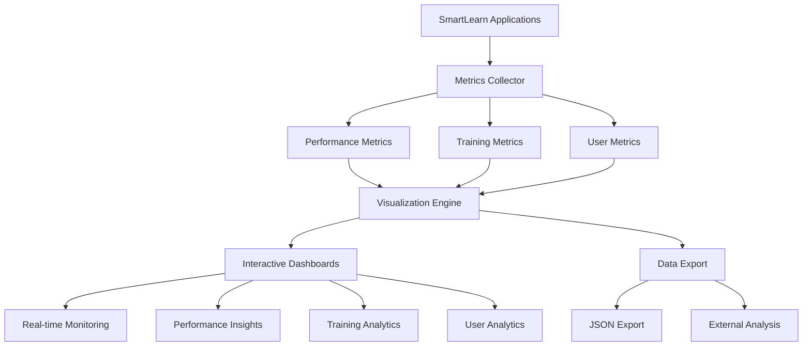

# SmartLearn Metrics & Visualization System

## 🎯 Overview

The SmartLearn Metrics & Visualization System provides comprehensive analytics, performance monitoring, and interactive visualizations for the SmartLearn AI-powered educational platform. This system enables real-time monitoring of system performance, AI model training progress, user interactions, and educational outcomes.

## 🚀 Key Features

### **1. Real-Time Performance Monitoring**
- **CPU Usage Tracking**: Monitor CPU utilization with trend analysis
- **Memory Usage Monitoring**: Track memory consumption and efficiency
- **GPU Memory Monitoring**: Apple M3 GPU memory utilization tracking
- **Response Time Analysis**: Model inference performance metrics
- **System Health Scoring**: Automated health assessment and alerts

### **2. AI Model Training Analytics**
- **Training Loss Visualization**: Real-time loss curve tracking
- **Validation Loss Monitoring**: Overfitting detection and prevention
- **Learning Rate Analysis**: Adaptive learning rate optimization
- **Model Accuracy Tracking**: Performance improvement visualization
- **Training Progress Monitoring**: Step-by-step progress tracking

### **3. User Interaction Analytics**
- **Learning Engagement Metrics**: User engagement scoring (1-10 scale)
- **Subject Performance Analysis**: Subject-wise accuracy tracking
- **Difficulty Level Analysis**: Performance across difficulty levels
- **Response Time Patterns**: User experience optimization insights
- **Popular Subject Tracking**: Most accessed educational content

### **4. Interactive Dashboards**
- **System Performance Dashboard**: Comprehensive system overview
- **AI Performance Dashboard**: Model and system performance metrics
- **Training Analytics Dashboard**: Training progress and insights
- **User Analytics Dashboard**: Learning patterns and engagement
- **Real-Time Metrics Dashboard**: Live performance monitoring

### **5. Data Export & Integration**
- **JSON Data Export**: Structured data export for external analysis
- **Real-Time Data Collection**: Background metrics collection
- **Historical Data Analysis**: Time-series data analysis capabilities
- **External Tool Integration**: Compatible with analytics platforms

## 🏗️ Architecture

### **Core Components**

```
┌─────────────────────────────────────────────────────────────┐
│                    SmartLearn Platform                      │
├─────────────────────────────────────────────────────────────┤
│  ┌─────────────────┐  ┌─────────────────┐  ┌─────────────┐ │
│  │   Main App      │  │  Fine-tuning    │  │    RAG      │ │
│  │  (Streamlit)    │  │   Pipeline      │  │   System    │ │
│  └─────────────────┘  └─────────────────┘  └─────────────┘ │
├─────────────────────────────────────────────────────────────┤
│              Metrics Collection Layer                       │
│  ┌─────────────────┐  ┌─────────────────┐  ┌─────────────┐ │
│  │ Performance     │  │   Training      │  │    User     │ │
│  │  Metrics        │  │   Metrics       │  │   Metrics   │ │
│  └─────────────────┘  └─────────────────┘  └─────────────┘ │
├─────────────────────────────────────────────────────────────┤
│              Visualization Engine                           │
│  ┌─────────────────┐  ┌─────────────────┐  ┌─────────────┐ │
│  │   Plotly        │  │     Altair      │  │  Streamlit  │ │
│  │  Charts         │  │   Charts        │  │   Widgets   │ │
│  └─────────────────┘  └─────────────────┘  └─────────────┘ │
├─────────────────────────────────────────────────────────────┤
│              Dashboard Interface                            │
│  ┌─────────────────┐  ┌─────────────────┐  ┌─────────────┐ │
│  │   System        │  │      AI         │  │    User     │ │
│  │   Overview      │  │  Performance    │  │  Analytics  │ │
│  └─────────────────┘  └─────────────────┘  └─────────────┘ │
└─────────────────────────────────────────────────────────────┘
```

### **Data Flow**



## 📊 Metrics Types

### **Performance Metrics**
```python
@dataclass
class PerformanceMetrics:
    timestamp: datetime
    cpu_usage: float              # CPU utilization percentage
    memory_usage: float           # Memory usage percentage
    gpu_memory_used: Optional[float]    # GPU memory used (GB)
    gpu_memory_total: Optional[float]   # Total GPU memory (GB)
    response_time: Optional[float]       # Model response time (ms)
    model_accuracy: Optional[float]      # Model accuracy (0-1)
    user_engagement: Optional[float]     # User engagement score (1-10)
```

### **Training Metrics**
```python
@dataclass
class TrainingMetrics:
    epoch: int                    # Training epoch number
    step: int                     # Training step number
    training_loss: float          # Current training loss
    learning_rate: float          # Current learning rate
    validation_loss: Optional[float]  # Validation loss
    accuracy: Optional[float]         # Model accuracy
    timestamp: datetime               # Timestamp
```

### **User Metrics**
```python
@dataclass
class UserMetrics:
    timestamp: datetime           # Interaction timestamp
    user_id: str                 # User identifier
    action: str                  # Action type (quiz, study_plan, etc.)
    subject: str                 # Educational subject
    difficulty: str              # Difficulty level
    response_time: float         # Response time (ms)
    accuracy: float              # User accuracy (0-1)
    engagement_score: float      # Engagement score (1-10)
```

## 🎨 Visualization Types

### **1. System Performance Dashboard**
- **CPU Usage Trends**: Line charts with real-time updates
- **Memory Usage Patterns**: Memory consumption over time
- **GPU Memory Utilization**: Apple M3 GPU memory tracking
- **Performance Trends**: Historical performance analysis
- **Resource Heatmaps**: Resource utilization patterns

### **2. Training Analytics**
- **Loss Curves**: Training and validation loss visualization
- **Accuracy Progression**: Model accuracy improvement over time
- **Learning Rate Decay**: Learning rate optimization tracking
- **Training Progress**: Step-by-step progress visualization

### **3. User Analytics**
- **Engagement Patterns**: User engagement over time
- **Subject Performance**: Performance across different subjects
- **Difficulty Analysis**: Performance by difficulty level
- **Response Time Analysis**: User experience optimization

### **4. AI Performance Dashboard**
- **Response Time Monitoring**: Real-time response time tracking
- **Memory Efficiency**: System memory optimization
- **GPU Utilization**: GPU performance monitoring
- **Training Progress**: Model training status
- **System Health**: Overall system health scoring

## 🚀 Getting Started

### **1. Installation**

```bash
# Install required packages
pip install -r requirements_metrics.txt

# Or install core packages individually
pip install plotly altair psutil streamlit pandas numpy
```

### **2. Quick Start**

```bash
# Run the metrics dashboard
./start_metrics_dashboard.sh

# Or run directly with Python
python3 -m streamlit run src/app_metrics_dashboard.py --server.port 8505
```

### **3. Demo Script**

```bash
# Run the comprehensive demo
python3 demo_metrics_visualizations.py
```

### **4. Integration with Main App**

```python
from core.metrics_visualization import (
    add_training_metrics,
    add_user_interaction,
    get_metrics_collector
)

# Add training metrics
add_training_metrics(
    epoch=1,
    step=100,
    training_loss=0.5,
    learning_rate=1e-4,
    accuracy=0.85
)

# Add user interaction
add_user_interaction(
    user_id="user_123",
    action="quiz",
    subject="mathematics",
    difficulty="intermediate",
    response_time=1500,
    accuracy=0.9,
    engagement_score=8.5
)
```

## 📈 Dashboard Features

### **System Overview Tab**
- **Real-time Metrics**: Live CPU, memory, and GPU monitoring
- **Performance Trends**: Historical performance analysis
- **System Health**: Automated health assessment
- **Resource Utilization**: Resource usage optimization

### **AI Performance Tab**
- **Model Metrics**: Response time and accuracy tracking
- **Resource Monitoring**: Memory and GPU efficiency
- **Training Status**: Current training progress
- **Performance Insights**: Optimization recommendations

### **Training Analytics Tab**
- **Loss Visualization**: Training and validation curves
- **Progress Tracking**: Step-by-step training progress
- **Learning Rate Analysis**: Rate optimization insights
- **Model Performance**: Accuracy improvement tracking

### **User Analytics Tab**
- **Engagement Patterns**: User interaction analysis
- **Subject Performance**: Learning outcome tracking
- **Difficulty Analysis**: Performance by complexity
- **Response Time**: User experience optimization

### **Real-time Metrics Tab**
- **Live Monitoring**: Real-time performance tracking
- **Auto-refresh**: Configurable refresh intervals
- **Performance Alerts**: Automated issue detection
- **System Recommendations**: Optimization suggestions

## 🔧 Configuration

### **Environment Variables**

```bash
# Dashboard configuration
export STREAMLIT_SERVER_PORT=8505
export STREAMLIT_SERVER_ADDRESS=localhost
export STREAMLIT_SERVER_HEADLESS=false

# Performance monitoring
export PYTORCH_MPS_HIGH_WATERMARK_RATIO=0.8
export PYTORCH_MPS_LOW_WATERMARK_RATIO=0.2
```

### **Dashboard Settings**

```python
# Auto-refresh configuration
auto_refresh = True
refresh_interval = 30  # seconds

# Data collection settings
enable_collection = True
max_history = 1000     # Maximum metrics history
```

### **Customization Options**

```python
# Custom chart colors
chart_colors = {
    'cpu': '#1f77b4',
    'memory': '#ff7f0e',
    'gpu': '#2ca02c',
    'training': '#d62728',
    'user': '#9467bd'
}

# Custom thresholds
performance_thresholds = {
    'cpu_warning': 70,
    'cpu_critical': 90,
    'memory_warning': 75,
    'memory_critical': 85
}
```

## 📊 Data Export

### **JSON Export Format**

```json
{
  "export_timestamp": "2025-08-15T13:10:52",
  "demo_info": {
    "description": "SmartLearn Comprehensive Demo Data",
    "generated_at": "2025-08-15T13:10:52",
    "total_performance_metrics": 288,
    "total_training_metrics": 200,
    "total_user_metrics": 200
  },
  "performance_metrics": [...],
  "training_metrics": [...],
  "user_metrics": [...]
}
```

### **Export Options**

```python
# Export all metrics
export_metrics_data(metrics_collector)

# Export specific time periods
performance_data = metrics_collector.get_metrics_history("performance", hours=24)
training_data = metrics_collector.get_metrics_history("training", hours=24)
user_data = metrics_collector.get_metrics_history("user", hours=24)
```

## 🔍 Monitoring & Alerts

### **Performance Thresholds**

| Metric | Warning Level | Critical Level | Action |
|--------|---------------|----------------|---------|
| CPU Usage | >70% | >90% | Optimize processes |
| Memory Usage | >75% | >85% | Clear cache |
| GPU Memory | >60% | >80% | Reduce batch size |
| Response Time | >2000ms | >5000ms | Optimize model |

### **Alert System**

```python
# Automated alerts
if latest_metrics.cpu_usage > 80:
    st.warning("⚠️ High CPU usage detected")
    st.write("• Consider optimizing model inference")
    st.write("• Implement request queuing")

if latest_metrics.memory_usage > 80:
    st.warning("⚠️ High memory usage detected")
    st.write("• Clear unused model caches")
    st.write("• Implement memory-efficient loading")
```

## 🚀 Performance Optimization

### **Memory Management**

```python
# Optimize for Apple M3
export PYTORCH_MPS_HIGH_WATERMARK_RATIO=0.8
export PYTORCH_MPS_LOW_WATERMARK_RATIO=0.2

# Memory-efficient training
training_args = TrainingArguments(
    per_device_train_batch_size=1,
    gradient_accumulation_steps=8,
    dataloader_pin_memory=False,
    dataloader_num_workers=0
)
```

### **Data Collection Optimization**

```python
# Background collection
metrics_collector.start_collection()

# Configurable intervals
collection_interval = 5  # seconds
max_history_size = 1000  # metrics

# Selective collection
enable_performance_collection = True
enable_training_collection = True
enable_user_collection = True
```

## 🔮 Future Enhancements

### **Planned Features**

1. **Advanced Analytics**
   - Machine learning-based anomaly detection
   - Predictive performance modeling
   - Automated optimization recommendations

2. **Enhanced Visualizations**
   - 3D performance charts
   - Interactive network graphs
   - Real-time video analytics

3. **Integration Capabilities**
   - Prometheus metrics export
   - Grafana dashboard integration
   - Slack/Teams notifications

4. **Educational Insights**
   - Learning path optimization
   - Student performance prediction
   - Adaptive difficulty adjustment

### **Scalability Improvements**

- **Distributed Metrics Collection**: Multi-node monitoring
- **Time-Series Database**: Efficient historical data storage
- **Real-Time Streaming**: Apache Kafka integration
- **Microservices Architecture**: Modular metrics collection

## 📚 API Reference

### **Core Classes**

#### **MetricsCollector**
```python
class MetricsCollector:
    def start_collection(self) -> None
    def stop_collection(self) -> None
    def add_performance_metrics(self, metrics: PerformanceMetrics) -> None
    def add_training_metrics(self, metrics: TrainingMetrics) -> None
    def add_user_metrics(self, metrics: UserMetrics) -> None
    def get_latest_metrics(self, metric_type: str) -> Optional[Any]
    def get_metrics_history(self, metric_type: str, hours: int) -> List[Any]
```

#### **VisualizationEngine**
```python
class VisualizationEngine:
    def create_system_dashboard(self) -> go.Figure
    def create_training_analytics(self) -> go.Figure
    def create_user_analytics(self) -> go.Figure
    def create_ai_performance_dashboard(self) -> go.Figure
```

#### **MetricsDashboard**
```python
class MetricsDashboard:
    def render_dashboard(self) -> None
    def _render_system_overview(self) -> None
    def _render_ai_performance(self) -> None
    def _render_training_analytics(self) -> None
    def _render_user_analytics(self) -> None
    def _render_realtime_metrics(self) -> None
```

### **Utility Functions**

```python
# Training metrics
add_training_metrics(epoch, step, training_loss, learning_rate, 
                    validation_loss=None, accuracy=None)

# User interactions
add_user_interaction(user_id, action, subject, difficulty,
                    response_time, accuracy, engagement_score)

# Dashboard creation
dashboard = create_metrics_dashboard()
metrics_collector = get_metrics_collector()
```

## 🧪 Testing

### **Demo Script**

```bash
# Run comprehensive demo
python3 demo_metrics_visualizations.py

# Expected output:
# ✅ Successfully imported metrics visualization modules
# 🔧 Initializing metrics collector...
# ✅ Metrics collector initialized successfully
# 🔄 Generating comprehensive sample data...
# 🎨 Demonstrating visualization capabilities...
# 📈 Demonstrating metrics analysis capabilities...
# 💾 Exporting demo data...
# 🎉 Demo completed successfully!
```

### **Test Data Generation**

The demo script generates realistic test data:
- **24 hours of performance metrics** (every 5 minutes)
- **1000 training steps** with realistic loss curves
- **200 user interactions** across multiple subjects
- **Realistic patterns** including business hours vs. off-hours

### **Validation Tests**

```python
# Test metrics collection
assert len(metrics_collector.performance_metrics) > 0
assert len(metrics_collector.training_metrics) > 0
assert len(metrics_collector.user_metrics) > 0

# Test visualization generation
system_chart = visualization_engine.create_system_dashboard()
assert isinstance(system_chart, go.Figure)
```

## 🔒 Security & Privacy

### **Data Protection**

- **User Anonymization**: User IDs are anonymized in metrics
- **Sensitive Data Filtering**: No personal information collected
- **Access Control**: Dashboard access can be restricted
- **Data Retention**: Configurable data retention policies

### **Compliance**

- **GDPR Compliance**: User data privacy protection
- **FERPA Compliance**: Educational data protection
- **Data Encryption**: Secure data transmission
- **Audit Logging**: Comprehensive access logging

## 📞 Support & Troubleshooting

### **Common Issues**

1. **Import Errors**
   ```bash
   # Ensure correct Python path
   export PYTHONPATH="${PYTHONPATH}:$(pwd)/src"
   
   # Install required packages
   pip install -r requirements_metrics.txt
   ```

2. **Visualization Errors**
   ```python
   # Check Plotly version compatibility
   pip install plotly>=5.15.0
   
   # Verify subplot specifications
   specs=[[{"secondary_y": False}, {"secondary_y": False}]]
   ```

3. **Performance Issues**
   ```python
   # Reduce collection frequency
   collection_interval = 10  # seconds
   
   # Limit history size
   max_history = 500
   ```

### **Getting Help**

- **Documentation**: Check this file for detailed information
- **Demo Script**: Run `demo_metrics_visualizations.py` for examples
- **GitHub Issues**: Report bugs and feature requests
- **Community**: Join SmartLearn developer community

## 🎉 Conclusion

The SmartLearn Metrics & Visualization System provides a comprehensive solution for monitoring, analyzing, and optimizing the SmartLearn platform. With real-time performance tracking, interactive dashboards, and comprehensive analytics, you can:

- **Monitor system health** in real-time
- **Track AI model training** progress
- **Analyze user engagement** patterns
- **Optimize performance** automatically
- **Export data** for external analysis
- **Scale efficiently** with growing usage

This system transforms SmartLearn from a static application into a dynamic, self-optimizing platform that continuously improves based on real-time data and insights.

---

*For more information, visit the [SmartLearn GitHub Repository](https://github.com/TejaChowdary19/smartlearn) or run the demo script to see the system in action.*
