# SmartLearn Project Workflow Documentation

## 🎯 Project Overview

SmartLearn is an AI-powered educational platform that generates personalized study plans, provides concept explanations, and creates adaptive quizzes. The system integrates multiple AI models, RAG (Retrieval-Augmented Generation), and advanced features for a comprehensive learning experience.

## 🏗️ System Architecture

### High-Level Architecture
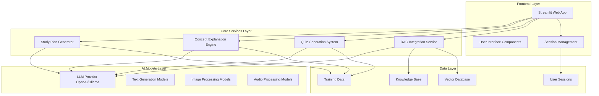

## 🔄 Core Workflows

### 1. Study Plan Generation Workflow

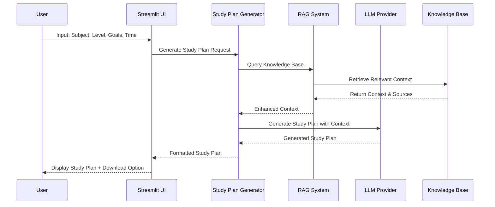

### 2. Concept Explanation Workflow

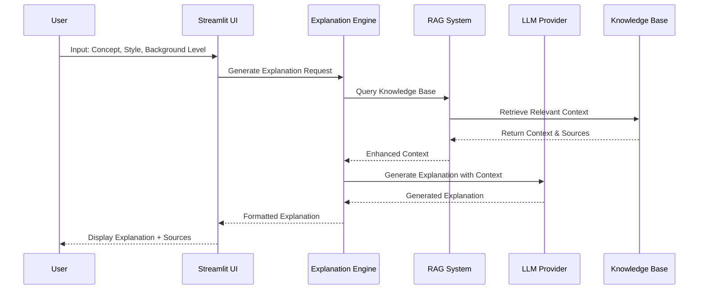

### 3. Quiz Generation & Assessment Workflow

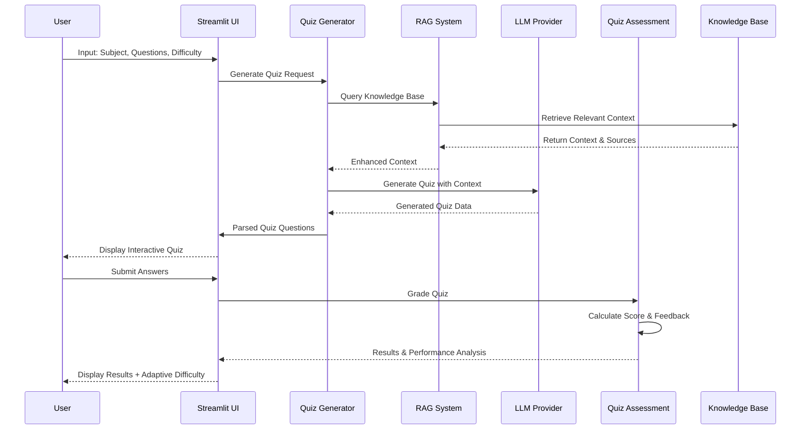

## 🧠 RAG Integration Workflow

### Knowledge Base Processing
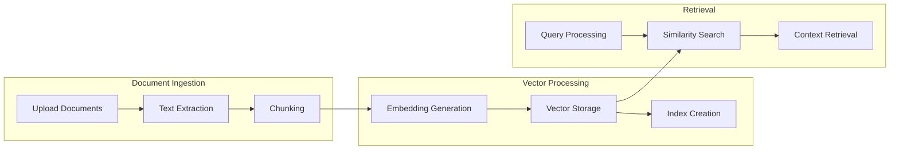

### RAG-Enhanced Response Generation
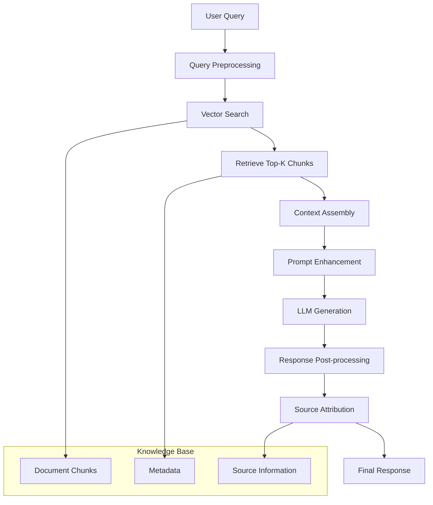

## 🔧 Advanced Features Workflow

### Multimodal Processing
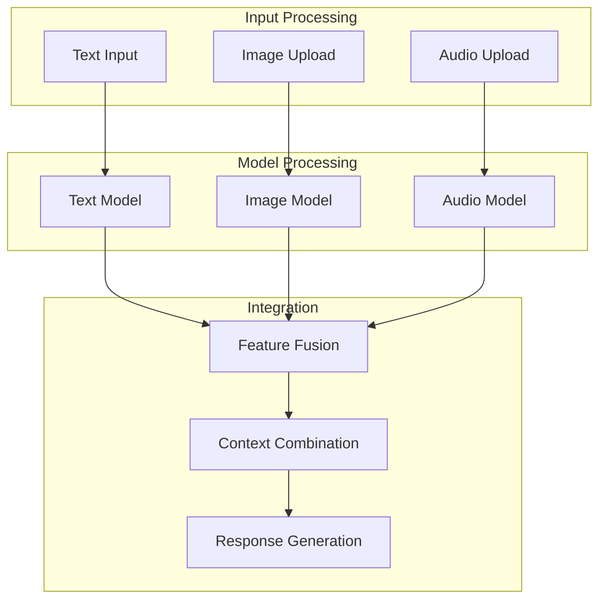

### Fine-tuning Workflow
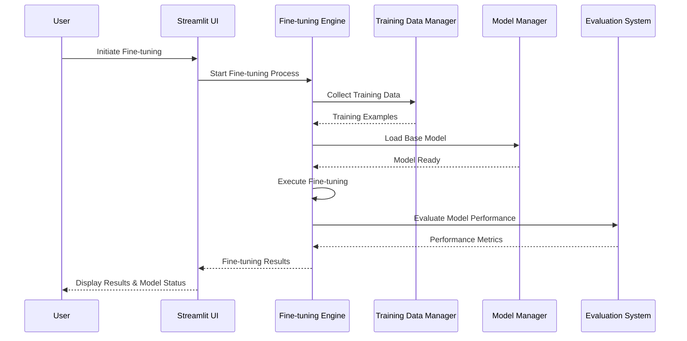

## 📊 Data Flow Architecture

### System Data Flow
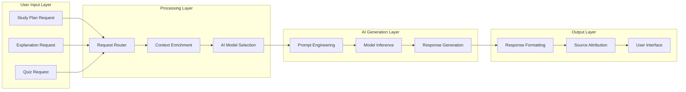

### Session Management Flow
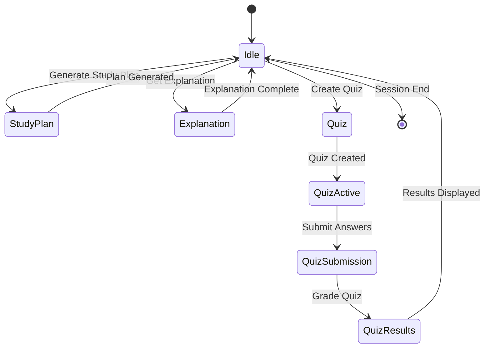

## 🎯 Key Components Interaction

### Component Dependencies
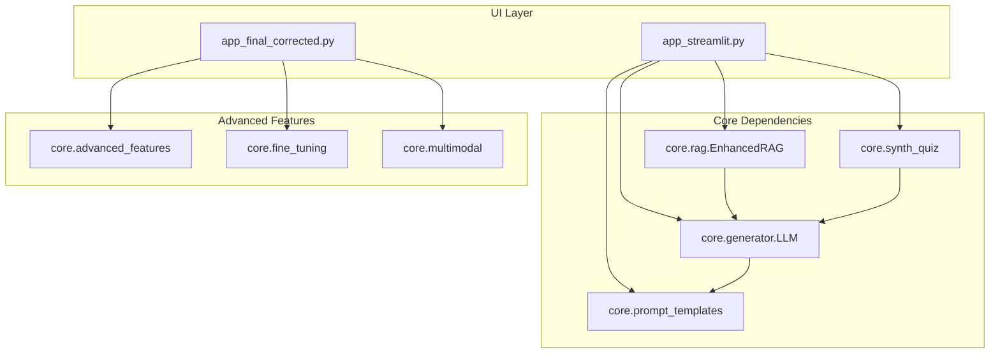

## 🚀 Performance Optimization

### Caching Strategy
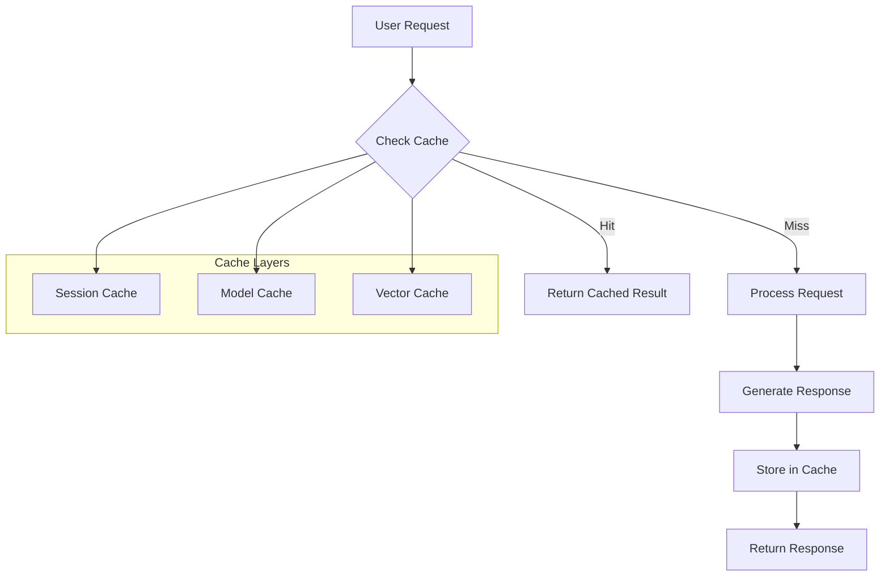

## 🔒 Security & Error Handling

### Error Handling Flow
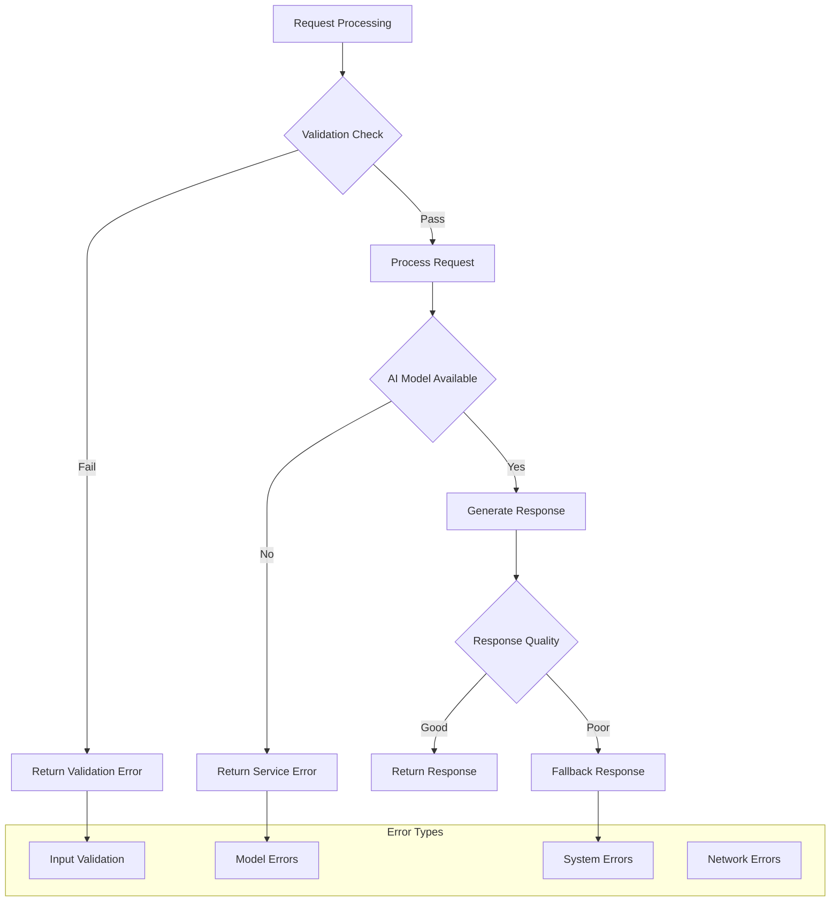

## 📈 Monitoring & Analytics

### System Monitoring
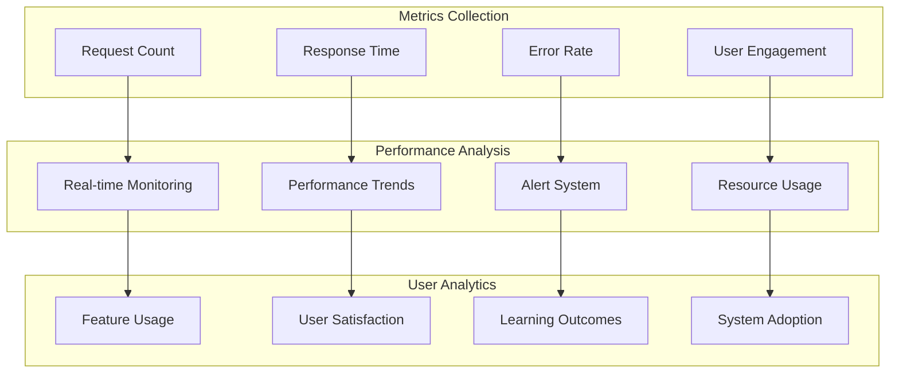

## 🎓 Educational Workflow Integration

### Learning Path Generation
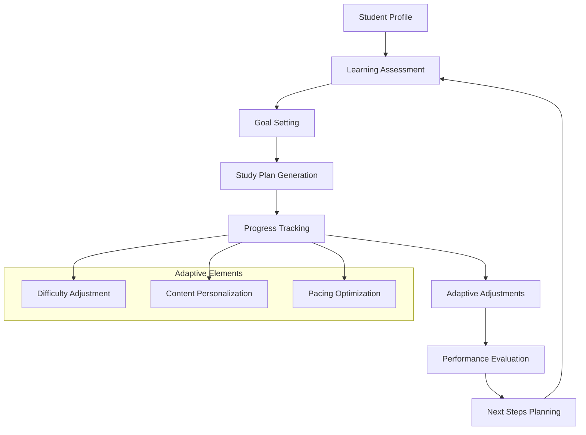

## 🔄 Continuous Improvement Loop

### System Evolution
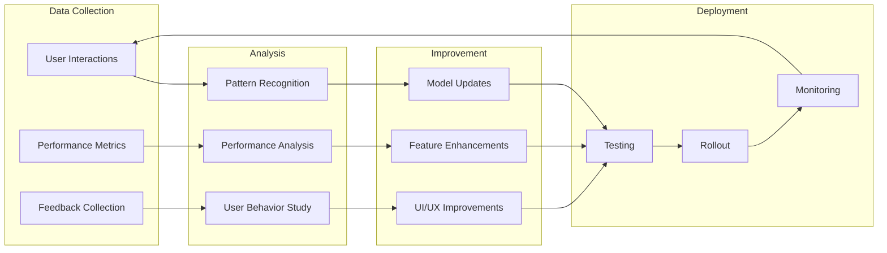

---

## 📝 Summary

This workflow documentation provides a comprehensive view of how SmartLearn operates as an integrated AI-powered educational platform. The system combines:

- **Modular Architecture** with clear separation of concerns
- **RAG Integration** for enhanced context-aware responses
- **Multimodal AI Models** for comprehensive learning support
- **Adaptive Learning** with personalized study plans and quizzes
- **Continuous Improvement** through data-driven optimization

The Mermaid diagrams visualize the complex interactions between components, making it easier to understand the system's behavior and optimize its performance.
